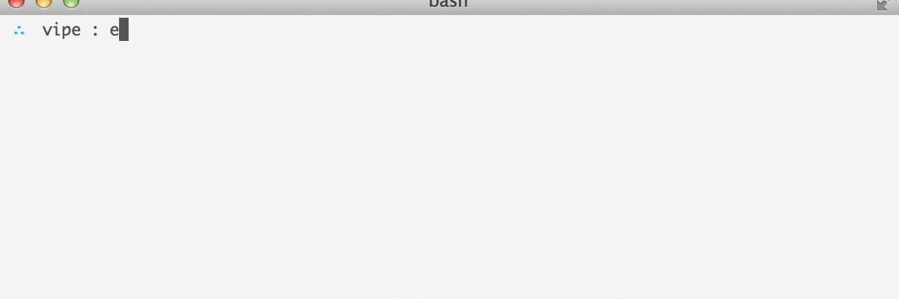

# go-vipe

  Pipe in and out of `$EDITOR`.

  Finally your editor is a real unix fellow, even if it doesn't support pipes at all!
  
  This is a go port of [juliangruber/vipe](https://github.com/juliangruber/vipe).

## Example



## Installation

```bash
$ go get github.com/juliangruber/go-vipe
```

## License

  MIT

